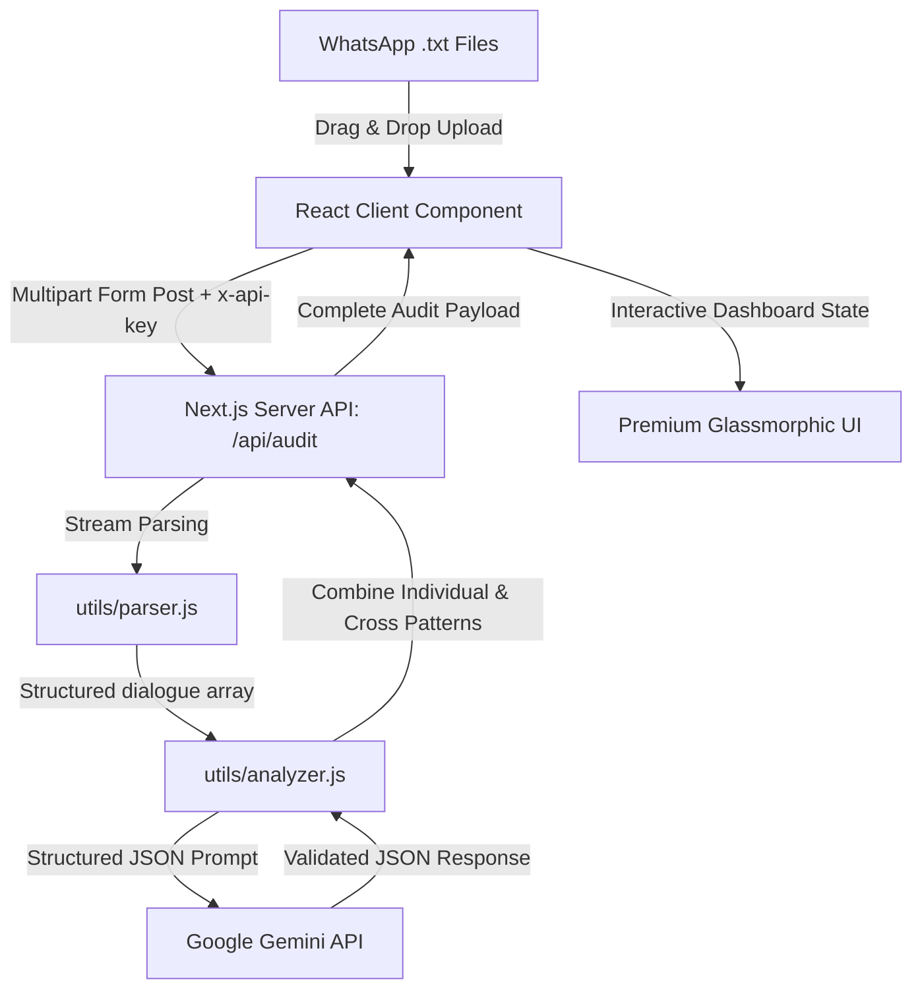

# Edoofa Conversational Audit Engine: Technical & Operational Explainer

This document outlines the design, architecture, and metrics of the **Edoofa Conversational Audit Engine**—a unified compliance system engineered to monitor and improve counselor-student dialogue quality.

---

## 1. The Audit Framework: Conversational Integrity & Patient-Counselor Relations (CICR)

The framework evaluates the alignment of counselor interactions with Edoofa's core values (**trust, transparency, and empathy**) against high-pressure, sales-driven coercive tactics. 

### Categories, Metrics & Rationale

| Code | Category Name | Core Measurement | Why it Matters for Edoofa Specifically |
| :--- | :--- | :--- | :--- |
| **FT** | **Financial Transparency** | Timely, clear disclosure of all fees, auxiliary platform/bank charges, and refund rules. | Delaying disclosures until students are emotionally invested leads to sticker shock and high dropouts when invoices are received. |
| **PC** | **Promise Contradiction** | Consistency between initial commitments (e.g. "free tuition") and later payment demands. | Edoofa’s policy is "all commitments are written and recorded". Discrepancies destroy organizational credibility. |
| **BV** | **Boundary Violations** | Respecting explicit requests for offline time (e.g., funerals, holy weekends, Easter). | Contacting families during grieving or spiritual times shows a lack of empathy and violates basic counseling ethics. |
| **AUP** | **Artificial Urgency** | Deadlines fabricated by counselors to force a sale vs. legitimate university/visa limits. | Artificial deadlines rush decisions; legitimate academic or immigration deadlines are constructive constraints. |
| **DTS** | **Defensive Tone Shifts** | Transitions from nurturing mentorship to defensive, cold, or transactional language. | Counselors are educators and mentors. Becoming hostile when program credibility is questioned signals a sales-first motive. |
| **GC** | **Guilt & Coercion** | Guilt-tripping or questioning a family's financial priorities or commitment to education. | Manipulative statements (e.g. "are you not even able to save $150?") lead to student/parent resentment and trust failure. |
| **AE** | **Authority Escalation** | Escalating calls to a "Program Director" under congratulatory guises to apply payment pressure. | Bringing in institutional authority figures under misleading pretenses is a coercive closing technique. |

---

## 2. Technical Architecture: Next.js App Router & Serverless Utilities

The application is built as a unified **Next.js App Router** project, combining a highly interactive frontend with secure, serverless processing utilities.



### Components & Modules
- **Frontend Dashboard ([page.js](file:///home/ishansh/Desktop/SkyFly/Hacks/edoofa/audit_tool/src/app/page.js)):** Built with React and Tailwind CSS. Employs a glassmorphic dark theme, path alias resolutions, and hydration-safe `localStorage` for API key handling.
- **Serverless API Route ([route.js](file:///home/ishansh/Desktop/SkyFly/Hacks/edoofa/audit_tool/src/app/api/audit/route.js)):** Processes incoming multi-file uploads in-memory, avoiding local disk writes. It coordinates parser outputs and Gemini audits.
- **Dialogue Parser ([parser.js](file:///home/ishansh/Desktop/SkyFly/Hacks/edoofa/audit_tool/src/utils/parser.js)):** A regex-based parser that handles timestamps, multi-line dialogue, and filters out system/media lines to build structured JSON log feeds.
- **Compliance Analyzer ([analyzer.js](file:///home/ishansh/Desktop/SkyFly/Hacks/edoofa/audit_tool/src/utils/analyzer.js)):** Integrates with the official `@google/generative-ai` SDK. Instructs the model to output validated JSON payloads mapping findings to precise dialogue quote IDs.

---

## 3. Key Design Decisions & Trade-Offs

1. **Next.js App Router Consolidation:**
   - *Decision:* Replaced the legacy separate Vite/Express folders with a single Next.js project.
   - *Trade-off:* Combines frontend styling and backend logic into a single repository, dramatically simplifying deployment (e.g., on Vercel) and dependency maintenance.

2. **In-Memory Streaming Parser:**
   - *Decision:* Raw WhatsApp exports are read and parsed in-memory on the server.
   - *Trade-off:* Prevents local disk storage risks, making the tool fully stateless and secure, although extremely large logs require reasonable server memory allocations.

3. **Dynamic Model Selection:**
   - *Decision:* Added a selector for switching models (`gemini-1.5-flash`, `gemini-1.5-pro`, `gemini-2.0-flash`, `gemini-2.5-flash`).
   - *Trade-off:* Gives auditors full control over speed vs. intelligence (e.g. Flash for rapid checks, Pro for deeper compliance tracking).

4. **Client-Side API Key Storage:**
   - *Decision:* API keys are entered by the auditor and stored only in browser `localStorage`, passed securely through custom headers.
   - *Trade-off:* Avoids central database credential leaks, prioritizing data security and making the prototype self-contained.

---

## 4. How to Run Locally

1. **Navigate to Project:**
   ```bash
   cd audit_tool
   ```
2. **Install Dependencies:**
   ```bash
   npm install
   ```
3. **Start Development Server:**
   ```bash
   npm run dev
   ```
4. **Access UI:**
   Open `http://localhost:3000` in your web browser. Provide your Gemini API Key in the header, upload chat logs, and run the audit.
